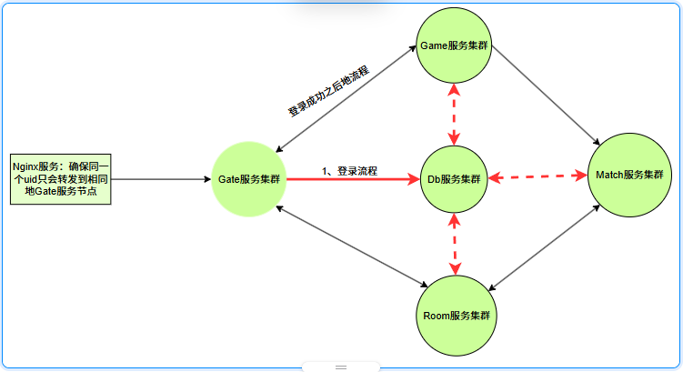

# universal游戏框架简介

做了多年游戏后台开发，看过很多游戏后台实现，闲暇无事时才有了该项目。谨以此纪念过往经历（个人练手项目）。
- 超简单地分布式golang游戏服务器框架。具体高性能，可伸缩、分布式等特点。
- 框架核心基于模板 + Actor实现。
- 框架工具齐全：cfgtool工具、dbtool工具、pbtool工具。
- 游戏开发者只要掌握游戏配置规则、redis代码生成规则，即可聚焦游戏核心业务逻辑，实现高效开发。
- 制约框架性能瓶颈的核心在于：网络IO、protobuf的序列化和反序列化、go原生gob的序列化和反序列化。
- 该框架很适合独立开发者、中型公司和小型公司使用，也适合个人参考学习。

```
C++20版本正在实现中，敬请期待...
```

## 一、框架示意图


## 二、框架核心逻辑说明

### 1、Actor模式
每个Actor实例都拥有独立的任务队列（高性能无锁任务队列）和任务处理协程，实现了各个Actor实例之间互不干扰。同时，各个Actor之间通过消息实现异步通信，有效避免了共享数据带来的并发竞争问题。Actor实例消息处理过程中，大量使用模板实现，无任何反射代码逻辑（反射性能比直接调用的性能低很多）。
```go
// 对于有特殊需求的开发者，可按照如下接口定义实现即可
type IActor interface {
	IAsync
	GetActorName() string
	Register(IActor, ...int)
	SendMsg(*pb.Head, ...interface{}) error
	Send(*pb.Head, []byte) error
	RegisterTimer(*uint64, *pb.Head, time.Duration, int32) error
}
```


### 2、服务注册与发现
框架默认使用etcd实现了服务注册与发现。对于有特殊需求的开发者，可自行实现服务注册与发现功能模块，只需要按照如下接口定义即可。
```go
type IDiscovery interface {
	Register(INode, int64) error
	Watch(INode) error
	Close() error
}
```
- 注意：目前框架还没有添加主从节点选举逻辑。


### 3、路由机制
框架为了追求高性能与高并发，没有使用redis做分布式全局路由。而是参考TCP/IP路由表机制实现了一套，即玩家每一跳地路由信息都会在当前服务缓存中存储（路由信息比较精简，占用内存可以忽略不计）。

难点1：某个服务器突然宕机之后，玩家该如何路由？
- 框架使用hash(UID)%count计算路由节点（框架暂时没有添加一致性哈希，有这个需求地开发者可自行添加）。
- 对于Gate服务而言，影响不大，游戏客户端只需要重新执行一遍登录流程即可（玩家还会路由到相同Db节点、game节点）。
- 对于Room服务而言，会造成玩家无法继续游戏，严重影响玩家体验。有资金实力地开发者可以部署主备节点，避免无服务可用。
- 对于Db服务而言，除非Db集权全部挂掉，不然不会影响正常地游戏业务。因为其他服务和Db服务地交互属于无状态，其他服务地请求可以发送到任何一个db节点。
- 对于Match服务而言，要具体看游戏业务地实现。如果按照无状态实现，既没有任何问题；否则也会造成严重影响。
- 对于Game服务而言，影响有点大，主要是玩家游戏数据会部分丢失。

难点2：各个服务器之间能否相互调用?


- 如上图所示，开发者需要严格规范数据流，这可以避免很多问题。

### 4、接口注册与跨服调用（IHandler）
目前框架只实现了几个常用地函数范式规范，支持protobuf和golang原生gob编码/解码。其他开发者可以扩展范式模式，只需要按照IHandler接口定义实现即可。

```go
// 应答函数
type SendRspFunc func(*pb.Head, interface{}) error

// 处理器接口
type IHandler interface {
	Call(SendRspFunc, IActor, *pb.Head, ...interface{}) func()
	Rpc(SendRspFunc, IActor, *pb.Head, []byte) func()
}
```

```go
//案例：
type CmdHandler[S any, T any, R any] func(*S, *pb.Head, *T, *R) error
func (f CmdHandler[S, T, R]) Call(sendrsp define.SendRspFunc, s define.IActor, head *pb.Head, args ...interface{}) func() {
    return func(){
        // ...todo...
    }
}

func (f CmdHandler[S, T, R]) Rpc(sendrsp define.SendRspFunc, s define.IActor, head *pb.Head, buf []byte) func() {
    return func(){
        // ...todo...
    }
}
```

### 5、集群管理模块（Cluster）
该模块实现了服务节点管理、玩家路由表管理、消息转发控制等核心功能。该模块地核心接口如下所示：
```go
// 节点管理接口
type INode interface {
	GetSelf() *pb.Node
	GetCount(pb.NodeType) int
	Get(pb.NodeType, int32) *pb.Node
	Del(pb.NodeType, int32) bool
	Add(*pb.Node) bool
	Random(pb.NodeType, uint64) *pb.Node
}

// 服务注册与服务发现接口
type IDiscovery interface {
	Register(INode, int64) error
	Watch(INode) error
	Close() error
}

// 路由接口
type IRouter interface {
	GetData() *pb.Router
	SetData(*pb.Router) IRouter
	Get(pb.NodeType) int32
	Set(pb.NodeType, int32) IRouter
}
type ITable interface {
	GetOrNew(uint64, *pb.Node) IRouter
	Get(uint64) IRouter
	Close()
}

// 消息接口
type IBus interface {
	SetBroadcastHandler(*pb.Node, func(*pb.Head, []byte)) error
	SetSendHandler(*pb.Node, func(*pb.Head, []byte)) error
	SetReplyHandler(*pb.Node, func(*pb.Head, []byte)) error
	Broadcast(*pb.Head, []byte) error
	Send(*pb.Head, []byte) error
	Request(*pb.Head, []byte, proto.Message) error
	Response(*pb.Head, []byte) error
	Close()
}
```

## 三、框架工具
### 1、cfgtool工具
该工具主要将游戏配置（xlsx配置）转成xxx.proto文件，并且通过模板自动生成配置读写代码，极大提高了游戏开发效率。
- @enum：表示定义地是枚举。
- @struct: 表示定义地是中间结构体。
- @config: 表示定义地是需要转成xxx.proto文件，并生成配置代码。

具体使用详情，请参考cofigure/xlsx/game.xlsx文件。

### 2、dbtool工具
该工具主要将*.pb.go文件中的"@dbtool:xxx"规则生成redis操作代码。
- @dbtool:hash|数据库名|key名:参数名@参数类型[,...]|field名：参数名@参数类型[,...]|#注释
- @dbtool:string|数据库名|key名:参数名@参数类型[,...]|#注释

``` protobuf
//@dbtool:hash|universal|uesr_data|uid@uint64|#玩家数据
message UserData {
  uint64 uid = 1;
  uint32 age = 2;
}
```

## 四、使用案例
```go
type Player struct {
	actor.Actor
}

func (p *Player) Init() {
	p.Actor.Register(p)
	p.Actor.Start()
	actor.Register(p)
}

func (p *Player) IsOnline(head *pb.Head, uid uint64) bool { 
    return false
}

func (p *Player) Login(head *pb.Head, req *pb.LoginReq, rsp *pb.LoginRsp)error {
    if req == nil || rsp == nil {
        // 该错误会自动设置到rsp.Head头中
        return uerror.New(1, -1, "请求参数为空")
    }
    mlog.Errorf("req:%v, rsp:%v", req, rsp)

    // 返回成功，框架会自动将rsp返回非gate网关，有gate网关转发到游戏客户端。
    return nil
}

// 所有接口注册，统一在init中。
func init() {
    handler.RegisterGob1[Player, uint64](pb.NodeType_Game, "Player.IsOnline", (*Player).IsOnline)

    handler.RegisterCmd[Player, pb.LoginReq, pb.LoginRsp](pb.NodeType_Game, "Player.Login", (*Player).Login)
}

func TestPlayer(t testing.T) {
    actor.Init(&pb.Node{Type: pb.NodeType_Game}, nil)
    usr := &Player{}
    usr.Init()

    // 向usr任务队列发送消息
    usr.SendMsg(&pb.Head{FuncName: "IsOnline"}, 10000110)

    // 等待usr处理完所有消息之后，主动关闭Actor协程和任务队列
    usr.Stop()
}
```

## 五、交流联系
```
QQ(wx)：812417032
```

