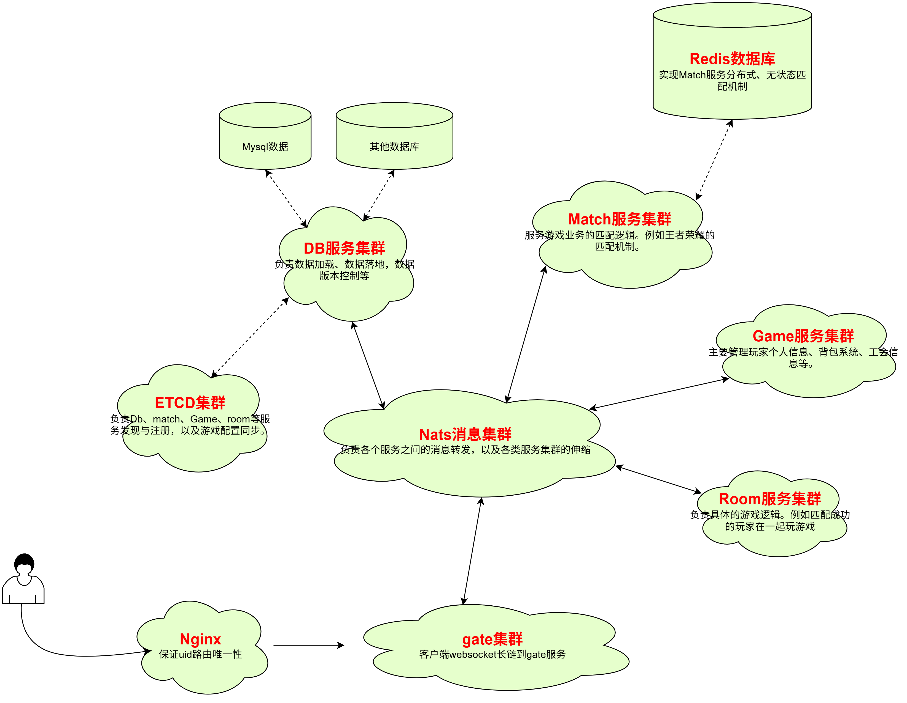

# universal游戏框架简介

做了多年游戏后台开发，看过很多游戏后台实现，闲暇无事时才有了该项目。谨以此纪念过往经历（个人练手项目）。
- 超简单地分布式golang游戏服务器框架。具体高性能，可伸缩、分布式等特点。
- 框架核心基于模板 + Actor实现。
- 框架工具齐全：cfgtool工具（xlsx转proto和go）、dbtool工具(proto转redis代码等)、pbtool工具（在.pb.go基础上在做代码生成）。
- 游戏开发者只要掌握游戏配置规则、redis代码生成规则，即可聚焦游戏核心业务逻辑，实现高效开发。
- 制约框架性能瓶颈的核心在于：网络IO、protobuf的序列化和反序列化、go原生gob的序列化和反序列化。


## 一、框架示意图



## 二、框架核心逻辑说明

### 1、Actor模式
每个Actor实例都拥有独立的任务队列（高性能无锁任务队列）和任务处理协程，实现了各个Actor实例之间互不干扰。同时，各个Actor之间通过消息实现异步通信，有效避免了共享数据带来的并发竞争问题。Actor实例消息处理过程中，大量使用模板实现，无任何反射代码逻辑（反射性能比直接调用的性能低很多）。
```go
type Player struct {
	actor.Actor
}

func (p *Player) Init() {
	p.Actor.Register(p)
	p.Actor.Start()
	actor.Register(p)
}

func (p *Player) IsOnline(head *pb.Head, uid uint64) bool { 
    return false
}

func (p *Player) Login(head *pb.Head, req *pb.LoginReq, rsp *pb.LoginRsp)error {
    if req == nil || rsp == nil {
        // 该错误会自动设置到rsp.Head头中
        return uerror.New(1, -1, "请求参数为空")
    }
    mlog.Errorf("req:%v, rsp:%v", req, rsp)

    // 返回成功，框架会自动将rsp返回非gate网关，有gate网关转发到游戏客户端。
    return nil
}

// 所有接口注册，统一在init中。
func init() {
    handler.RegisterGob1[Player, uint64](pb.NodeType_Game, "Player.IsOnline", (*Player).IsOnline)

    handler.RegisterCmd[Player, pb.LoginReq, pb.LoginRsp](pb.NodeType_Game, "Player.Login", (*Player).Login)
}

func TestPlayer(t testing.T) {
    actor.Init(&pb.Node{Type: pb.NodeType_Game}, nil)
    usr := &Player{}
    usr.Init()

    // 向usr任务队列发送消息
    usr.SendMsg(&pb.Head{FuncName: "IsOnline"}, 10000110)

    // 等待usr处理完所有消息之后，主动关闭Actor协程和任务队列
    usr.Stop()
}

```

## 三、交流联系
```
QQ(wx)：812417032

C++20版本universal框架正在开发中，敬请期待

```